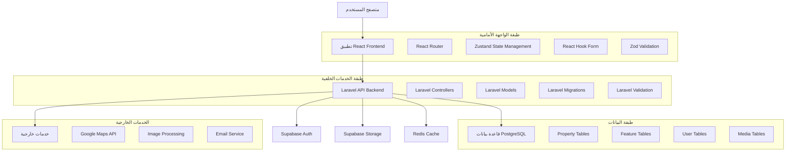
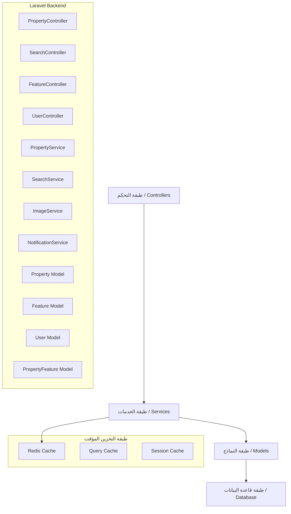
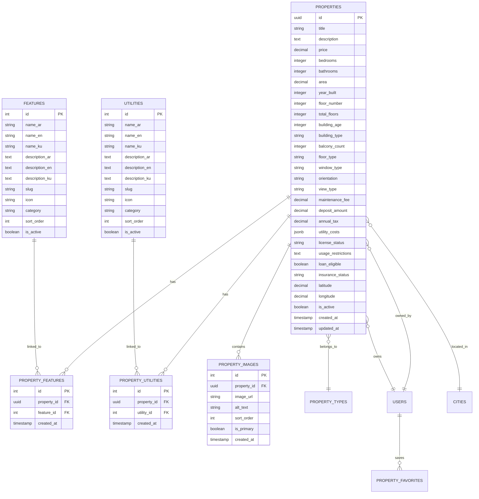

# الهندسة المعمارية التقنية المحسنة لنظام إدارة العقارات

## 1. تصميم الهندسة المعمارية



## 2. وصف التقنيات

* **الواجهة الأمامية**: React\@18 + TypeScript + Tailwind CSS + Vite + React Router + Zustand + React Hook Form + Zod

* **الخدمات الخلفية**: Laravel\@10 + PHP\@8.2 + Laravel Sanctum

* **قاعدة البيانات**: PostgreSQL\@15 + Redis\@7 (للتخزين المؤقت)

* **المصادقة والتخزين**: Supabase Auth + Supabase Storage

* **الخدمات الخارجية**: Google Maps API + Image Processing Services

## 3. تعريفات المسارات

| المسار        | الغرض                                             |
| ------------- | ------------------------------------------------- |
| /             | الصفحة الرئيسية مع البحث السريع والعقارات المميزة |
| /search       | صفحة البحث المتقدم مع الفلاتر الشاملة             |
| /property/:id | صفحة تفاصيل العقار مع جميع المعلومات المحسنة      |
| /add-property | صفحة إضافة عقار جديد (متعددة الخطوات)             |
| /dashboard    | لوحة تحكم المعلن مع الإحصائيات                    |
| /favorites    | صفحة العقارات المفضلة                             |
| /profile      | صفحة الملف الشخصي وإعدادات الحساب                 |
| /login        | صفحة تسجيل الدخول                                 |
| /register     | صفحة إنشاء حساب جديد                              |

## 4. تعريفات واجهة برمجة التطبيقات

### 4.1 واجهات برمجة التطبيقات الأساسية

#### إدارة العقارات

```
POST /api/properties
```

الطلب:

| اسم المعامل        | نوع المعامل | مطلوب | الوصف                 |
| ------------------ | ----------- | ----- | --------------------- |
| title              | string      | true  | عنوان العقار          |
| description        | text        | true  | وصف العقار            |
| price              | decimal     | true  | السعر                 |
| property\_type\_id | integer     | true  | نوع العقار            |
| floor\_number      | integer     | false | رقم الطابق            |
| total\_floors      | integer     | false | إجمالي الطوابق        |
| building\_age      | integer     | false | عمر المبنى            |
| balcony\_count     | integer     | false | عدد الشرفات           |
| orientation        | string      | false | اتجاه العقار          |
| view\_type         | string      | false | نوع الإطلالة          |
| maintenance\_fee   | decimal     | false | رسوم الصيانة          |
| features           | array       | false | مصفوفة معرفات الميزات |
| utilities          | array       | false | مصفوفة معرفات المرافق |

الاستجابة:

| اسم المعامل | نوع المعامل | الوصف                 |
| ----------- | ----------- | --------------------- |
| success     | boolean     | حالة العملية          |
| data        | object      | بيانات العقار المنشأ  |
| message     | string      | رسالة النجاح أو الخطأ |

مثال:

```json
{
  "title": "شقة فاخرة مع إطلالة بحرية",
  "price": 250000,
  "floor_number": 5,
  "total_floors": 10,
  "orientation": "south",
  "view_type": "sea",
  "features": [1, 2, 5, 8],
  "utilities": [1, 3, 4]
}
```

#### البحث المتقدم

```
GET /api/properties/search
```

الطلب:

| اسم المعامل    | نوع المعامل | مطلوب | الوصف                 |
| -------------- | ----------- | ----- | --------------------- |
| q              | string      | false | نص البحث              |
| property\_type | integer     | false | نوع العقار            |
| min\_price     | decimal     | false | الحد الأدنى للسعر     |
| max\_price     | decimal     | false | الحد الأقصى للسعر     |
| floor\_number  | integer     | false | رقم الطابق            |
| has\_elevator  | boolean     | false | وجود مصعد             |
| balcony\_count | integer     | false | عدد الشرفات           |
| orientation    | string      | false | الاتجاه               |
| view\_type     | string      | false | نوع الإطلالة          |
| features       | array       | false | الميزات المطلوبة      |
| utilities      | array       | false | المرافق المطلوبة      |
| page           | integer     | false | رقم الصفحة            |
| per\_page      | integer     | false | عدد النتائج في الصفحة |

الاستجابة:

```json
{
  "success": true,
  "data": {
    "properties": [...],
    "pagination": {
      "current_page": 1,
      "total_pages": 10,
      "total_count": 95
    },
    "filters": {
      "applied_filters": {...},
      "available_filters": {...}
    }
  }
}
```

#### إحصائيات العقار

```
GET /api/properties/{id}/statistics
```

الاستجابة:

| اسم المعامل         | نوع المعامل | الوصف                     |
| ------------------- | ----------- | ------------------------- |
| views\_count        | integer     | عدد المشاهدات             |
| inquiries\_count    | integer     | عدد الاستفسارات           |
| favorites\_count    | integer     | عدد مرات الحفظ في المفضلة |
| similar\_properties | array       | العقارات المشابهة         |
| price\_comparison   | object      | مقارنة الأسعار مع السوق   |

## 5. مخطط هندسة الخادم



## 6. نموذج البيانات

### 6.1 تعريف نموذج البيانات



### 6.2 لغة تعريف البيانات (DDL)

#### جدول العقارات المحسن

```sql
-- تحديث جدول العقارات
ALTER TABLE properties ADD COLUMN IF NOT EXISTS floor_number INTEGER;
ALTER TABLE properties ADD COLUMN IF NOT EXISTS total_floors INTEGER;
ALTER TABLE properties ADD COLUMN IF NOT EXISTS building_age INTEGER;
ALTER TABLE properties ADD COLUMN IF NOT EXISTS building_type VARCHAR(50);
ALTER TABLE properties ADD COLUMN IF NOT EXISTS balcony_count INTEGER DEFAULT 0;
ALTER TABLE properties ADD COLUMN IF NOT EXISTS floor_type VARCHAR(50);
ALTER TABLE properties ADD COLUMN IF NOT EXISTS window_type VARCHAR(50);
ALTER TABLE properties ADD COLUMN IF NOT EXISTS orientation VARCHAR(20);
ALTER TABLE properties ADD COLUMN IF NOT EXISTS view_type VARCHAR(50);
ALTER TABLE properties ADD COLUMN IF NOT EXISTS maintenance_fee DECIMAL(10,2);
ALTER TABLE properties ADD COLUMN IF NOT EXISTS deposit_amount DECIMAL(10,2);
ALTER TABLE properties ADD COLUMN IF NOT EXISTS annual_tax DECIMAL(10,2);
ALTER TABLE properties ADD COLUMN IF NOT EXISTS utility_costs JSONB;
ALTER TABLE properties ADD COLUMN IF NOT EXISTS license_status VARCHAR(50);
ALTER TABLE properties ADD COLUMN IF NOT EXISTS usage_restrictions TEXT;
ALTER TABLE properties ADD COLUMN IF NOT EXISTS loan_eligible BOOLEAN DEFAULT true;
ALTER TABLE properties ADD COLUMN IF NOT EXISTS insurance_status VARCHAR(50);

-- إنشاء فهارس للأداء
CREATE INDEX IF NOT EXISTS idx_properties_floor_number ON properties(floor_number);
CREATE INDEX IF NOT EXISTS idx_properties_total_floors ON properties(total_floors);
CREATE INDEX IF NOT EXISTS idx_properties_building_age ON properties(building_age);
CREATE INDEX IF NOT EXISTS idx_properties_orientation ON properties(orientation);
CREATE INDEX IF NOT EXISTS idx_properties_view_type ON properties(view_type);
CREATE INDEX IF NOT EXISTS idx_properties_balcony_count ON properties(balcony_count);
CREATE INDEX IF NOT EXISTS idx_properties_maintenance_fee ON properties(maintenance_fee);

-- فهرس مركب للبحث المتقدم
CREATE INDEX IF NOT EXISTS idx_properties_search_advanced ON properties(
    property_type_id, 
    price, 
    floor_number, 
    orientation, 
    view_type, 
    is_active
);
```

#### إضافة ميزات جديدة

```sql
-- إضافة الميزات المفقودة
INSERT INTO features (name_ar, name_en, name_ku, category, icon, is_active, sort_order) VALUES
('مصعد', 'Elevator', 'Elevator', 'building', 'fas fa-elevator', true, 1),
('شرفة', 'Balcony', 'Balcony', 'interior', 'fas fa-home', true, 2),
('حارس أمن', 'Security Guard', 'Security Guard', 'security', 'fas fa-shield-alt', true, 3),
('كاميرات مراقبة', 'Security Cameras', 'Security Cameras', 'security', 'fas fa-video', true, 4),
('بوابة إلكترونية', 'Electronic Gate', 'Electronic Gate', 'security', 'fas fa-door-open', true, 5),
('صالة رياضية', 'Gym', 'Gym', 'amenities', 'fas fa-dumbbell', true, 6),
('حديقة خاصة', 'Private Garden', 'Private Garden', 'outdoor', 'fas fa-tree', true, 7),
('ملعب أطفال', 'Playground', 'Playground', 'amenities', 'fas fa-child', true, 8),
('موقف سيارات مغطى', 'Covered Parking', 'Covered Parking', 'parking', 'fas fa-car', true, 9),
('تدفئة مركزية', 'Central Heating', 'Central Heating', 'utilities', 'fas fa-fire', true, 10),
('تكييف مركزي', 'Central AC', 'Central AC', 'utilities', 'fas fa-snowflake', true, 11),
('إنترنت عالي السرعة', 'High Speed Internet', 'High Speed Internet', 'utilities', 'fas fa-wifi', true, 12),
('غاز طبيعي', 'Natural Gas', 'Natural Gas', 'utilities', 'fas fa-fire-alt', true, 13),
('نظام إنذار', 'Alarm System', 'Alarm System', 'security', 'fas fa-bell', true, 14),
('جاكوزي', 'Jacuzzi', 'Jacuzzi', 'luxury', 'fas fa-hot-tub', true, 15)
ON CONFLICT (name_en) DO NOTHING;
```

#### إضافة مرافق جديدة

```sql
-- إضافة المرافق المفقودة
INSERT INTO utilities (name_ar, name_en, name_ku, category, icon, is_active, sort_order) VALUES
('مدارس قريبة', 'Nearby Schools', 'Nearby Schools', 'education', 'fas fa-school', true, 1),
('مستشفيات قريبة', 'Nearby Hospitals', 'Nearby Hospitals', 'healthcare', 'fas fa-hospital', true, 2),
('مواصلات عامة', 'Public Transport', 'Public Transport', 'transport', 'fas fa-bus', true, 3),
('مراكز تسوق', 'Shopping Centers', 'Shopping Centers', 'shopping', 'fas fa-shopping-cart', true, 4),
('مساجد قريبة', 'Nearby Mosques', 'Nearby Mosques', 'religious', 'fas fa-mosque', true, 5),
('حدائق عامة', 'Public Parks', 'Public Parks', 'recreation', 'fas fa-tree', true, 6),
('مطاعم ومقاهي', 'Restaurants & Cafes', 'Restaurants & Cafes', 'dining', 'fas fa-utensils', true, 7),
('بنوك وصرافات', 'Banks & ATMs', 'Banks & ATMs', 'financial', 'fas fa-university', true, 8),
('صيدليات', 'Pharmacies', 'Pharmacies', 'healthcare', 'fas fa-pills', true, 9),
('محطات وقود', 'Gas Stations', 'Gas Stations', 'transport', 'fas fa-gas-pump', true, 10)
ON CONFLICT (name_en) DO NOTHING;
```

#### جدول إحصائيات العقارات

```sql
-- إنشاء جدول إحصائيات العقارات
CREATE TABLE IF NOT EXISTS property_statistics (
    id SERIAL PRIMARY KEY,
    property_id UUID REFERENCES properties(id) ON DELETE CASCADE,
    views_count INTEGER DEFAULT 0,
    inquiries_count INTEGER DEFAULT 0,
    favorites_count INTEGER DEFAULT 0,
    last_viewed_at TIMESTAMP,
    created_at TIMESTAMP DEFAULT NOW(),
    updated_at TIMESTAMP DEFAULT NOW(),
    UNIQUE(property_id)
);

-- فهرس للأداء
CREATE INDEX IF NOT EXISTS idx_property_statistics_property_id ON property_statistics(property_id);
CREATE INDEX IF NOT EXISTS idx_property_statistics_views ON property_statistics(views_count DESC);
```

#### جدول البحثات المحفوظة

```sql
-- إنشاء جدول البحثات المحفوظة
CREATE TABLE IF NOT EXISTS saved_searches (
    id SERIAL PRIMARY KEY,
    user_id UUID REFERENCES users(id) ON DELETE CASCADE,
    name VARCHAR(255) NOT NULL,
    search_criteria JSONB NOT NULL,
    notification_enabled BOOLEAN DEFAULT true,
    created_at TIMESTAMP DEFAULT NOW(),
    updated_at TIMESTAMP DEFAULT NOW()
);

-- فهرس للأداء
CREATE INDEX IF NOT EXISTS idx_saved_searches_user_id ON saved_searches(user_id);
CREATE INDEX IF NOT EXISTS idx_saved_searches_criteria ON saved_searches USING GIN(search_criteria);
```

## 7. تحسينات الأداء والأمان

### 7.1 تحسينات الأداء

* استخدام Redis للتخزين المؤقت للبحثات الشائعة

* فهرسة متقدمة لاستعلامات البحث المعقدة

* ضغط الصور وتحسين التحميل

* تحميل البيانات بشكل تدريجي (Pagination)

### 7.2 تحسينات الأمان

* تشفير البيانات الحساسة

* التحقق من صحة جميع المدخلات

* حماية من هجمات SQL Injection

* نظام صلاحيات متقدم

### 7.3 المراقبة والتحليل

* تتبع أداء الاستعلامات

* مراقبة استخدام الذاكرة

* تحليل سلوك المستخدمين

* تقارير الأخطاء التلقائية

