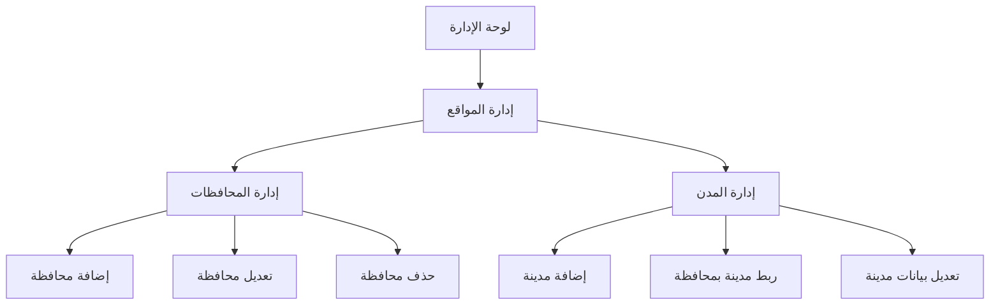

# نظام إدارة المحافظات والمدن - وثيقة متطلبات المنتج

## 1. نظرة عامة على المنتج

نظام إدارة المحافظات والمدن هو تطوير لنظام إدارة العقارات الحالي لإضافة مستوى جديد من التنظيم الجغرافي. يهدف النظام إلى إنشاء هيكل هرمي للمواقع الجغرافية حيث تنتمي المدن إلى محافظات، مما يوفر تنظيماً أفضل وإدارة أكثر دقة للعقارات حسب المواقع الجغرافية.

يحل النظام مشكلة عدم وجود تصنيف هرمي واضح للمواقع الجغرافية، ويستهدف مديري النظام والمستخدمين الذين يحتاجون لتصفح العقارات حسب المحافظات والمدن.

## 2. الميزات الأساسية

### 2.1 أدوار المستخدمين

| الدور | طريقة التسجيل | الصلاحيات الأساسية |
|------|----------------|--------------------|
| مدير النظام | تسجيل دخول بحساب إداري | إدارة كاملة للمحافظات والمدن والأحياء |
| مدير المحتوى | تعيين من قبل مدير النظام | إضافة وتعديل المحافظات والمدن |
| المستخدم العادي | تسجيل عادي | عرض وتصفح المحافظات والمدن |

### 2.2 وحدات الميزات

يتكون نظام إدارة المحافظات والمدن من الصفحات الأساسية التالية:
1. **صفحة إدارة المحافظات**: عرض وإدارة المحافظات، إضافة محافظة جديدة، تعديل وحذف المحافظات
2. **صفحة إدارة المدن المحدثة**: عرض المدن مع ربطها بالمحافظات، إضافة مدن جديدة مع تحديد المحافظة
3. **صفحة تفاصيل المحافظة**: عرض تفاصيل المحافظة والمدن التابعة لها
4. **صفحة إعدادات الربط**: إدارة العلاقات بين المحافظات والمدن

### 2.3 تفاصيل الصفحات

| اسم الصفحة | اسم الوحدة | وصف الميزة |
|------------|------------|-------------|
| صفحة إدارة المحافظات | قائمة المحافظات | عرض جميع المحافظات مع عدد المدن التابعة، البحث والتصفية، ترقيم الصفحات |
| صفحة إدارة المحافظات | نموذج إضافة محافظة | إدخال اسم المحافظة بالعربية والإنجليزية، تحديد الإحداثيات، تفعيل/إلغاء تفعيل |
| صفحة إدارة المحافظات | نموذج تعديل محافظة | تعديل بيانات المحافظة الموجودة، حفظ التغييرات، التحقق من صحة البيانات |
| صفحة إدارة المدن المحدثة | قائمة المدن | عرض المدن مع اسم المحافظة التابعة لها، تصفية حسب المحافظة، البحث في أسماء المدن |
| صفحة إدارة المدن المحدثة | نموذج إضافة مدينة | إدخال اسم المدينة، اختيار المحافظة من قائمة منسدلة، تحديد الإحداثيات |
| صفحة تفاصيل المحافظة | معلومات المحافظة | عرض تفاصيل المحافظة، إحصائيات المدن والأحياء، عدد العقارات |
| صفحة تفاصيل المحافظة | قائمة المدن التابعة | عرض جميع المدن في المحافظة، روابط سريعة لإدارة كل مدينة |

## 3. العملية الأساسية

**تدفق عمل مدير النظام:**
1. تسجيل الدخول إلى لوحة الإدارة
2. الانتقال إلى قسم إدارة المواقع
3. إدارة المحافظات: إضافة، تعديل، أو حذف محافظات
4. إدارة المدن: ربط المدن بالمحافظات المناسبة
5. مراجعة العلاقات والتأكد من صحة البيانات

**تدفق عمل المستخدم العادي:**
1. تصفح العقارات حسب المحافظة
2. اختيار مدينة من المدن التابعة للمحافظة
3. عرض العقارات المتاحة في المدينة المحددة

## 4. تصميم واجهة المستخدم

### 4.1 نمط التصميم

- **الألوان الأساسية**: #007bff (أزرق أساسي)، #6c757d (رمادي ثانوي)
- **نمط الأزرار**: أزرار مستديرة الحواف مع تأثيرات hover
- **الخط وأحجامه**: خط Tajawal للعربية، Roboto للإنجليزية، حجم 14px للنص العادي، 18px للعناوين
- **نمط التخطيط**: تخطيط قائم على البطاقات، شريط تنقل علوي، شريط جانبي للإدارة
- **الأيقونات**: أيقونات Font Awesome، استخدام أيقونات الخريطة والمواقع

### 4.2 نظرة عامة على تصميم الصفحات

| اسم الصفحة | اسم الوحدة | عناصر واجهة المستخدم |
|------------|------------|----------------------|
| صفحة إدارة المحافظات | قائمة المحافظات | جدول بتصميم Bootstrap، أزرار إجراءات ملونة، مربع بحث، فلاتر منسدلة |
| صفحة إدارة المحافظات | نموذج إضافة | نموذج من عمودين، حقول نصية مع تسميات واضحة، أزرار حفظ وإلغاء |
| صفحة إدارة المدن | قائمة المدن | جدول مع عمود إضافي للمحافظة، فلتر حسب المحافظة، ألوان متناسقة |
| صفحة تفاصيل المحافظة | بطاقة المعلومات | بطاقة كبيرة مع إحصائيات، رسوم بيانية بسيطة، ألوان متدرجة |

### 4.3 الاستجابة للأجهزة

النظام مصمم ليكون متجاوباً مع جميع الأجهزة، مع التركيز على سطح المكتب أولاً ثم التكيف مع الأجهزة المحمولة. يتضمن تحسينات للمس في الأجهزة اللوحية والهواتف الذكية.