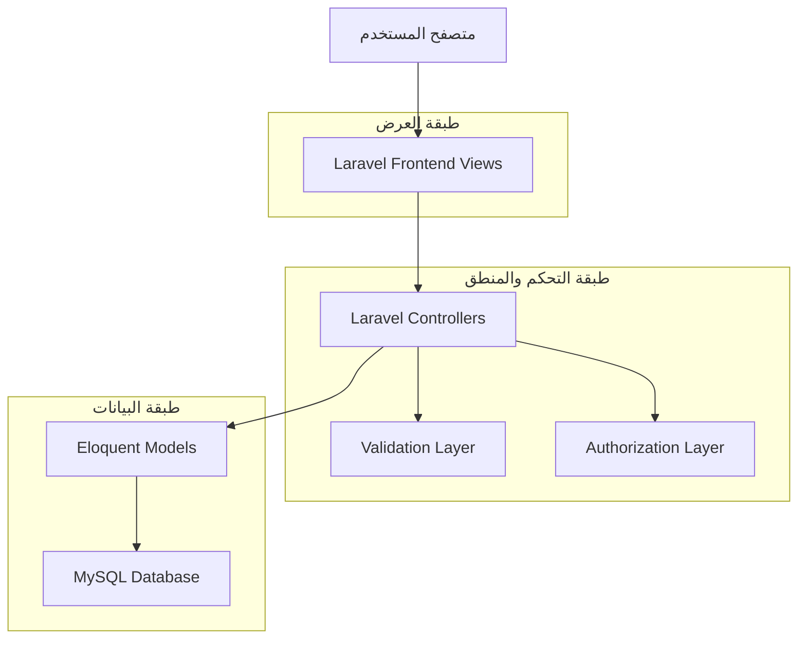
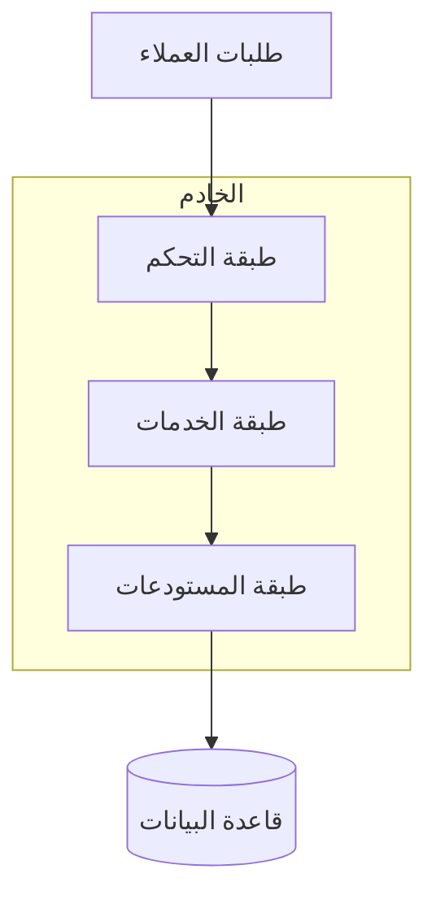
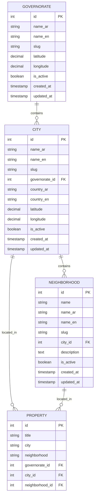

# نظام إدارة المحافظات والمدن - وثيقة الهندسة التقنية

## 1. تصميم الهندسة المعمارية



## 2. وصف التقنيات

- Frontend: Laravel Blade Templates + Bootstrap 4 + jQuery + AdminLTE
- Backend: Laravel 10 + PHP 8.1
- Database: MySQL 8.0
- Authentication: Laravel Sanctum
- Authorization: Laravel Gates & Policies

## 3. تعريفات المسارات

| المسار | الغرض |
|--------|-------|
| /admin/governorates | صفحة إدارة المحافظات الرئيسية |
| /admin/governorates/create | صفحة إضافة محافظة جديدة |
| /admin/governorates/{id}/edit | صفحة تعديل محافظة |
| /admin/governorates/{id} | صفحة تفاصيل المحافظة |
| /admin/cities | صفحة إدارة المدن المحدثة |
| /admin/cities/create | صفحة إضافة مدينة جديدة مع اختيار المحافظة |
| /admin/ajax/cities-by-governorate | API للحصول على المدن حسب المحافظة |

## 4. تعريفات API

### 4.1 واجهات برمجة التطبيقات الأساسية

**إدارة المحافظات**
```
GET /admin/governorates
```

الاستجابة:
| اسم المعامل | نوع المعامل | الوصف |
|-------------|-------------|-------|
| governorates | array | قائمة المحافظات مع عدد المدن |
| pagination | object | معلومات ترقيم الصفحات |

```
POST /admin/governorates
```

الطلب:
| اسم المعامل | نوع المعامل | مطلوب | الوصف |
|-------------|-------------|-------|-------|
| name_ar | string | نعم | اسم المحافظة بالعربية |
| name_en | string | نعم | اسم المحافظة بالإنجليزية |
| slug | string | نعم | الرابط المختصر |
| latitude | decimal | لا | خط العرض |
| longitude | decimal | لا | خط الطول |
| is_active | boolean | لا | حالة التفعيل |

مثال:
```json
{
  "name_ar": "دمشق",
  "name_en": "Damascus",
  "slug": "damascus",
  "latitude": 33.5138,
  "longitude": 36.2765,
  "is_active": true
}
```

**الحصول على المدن حسب المحافظة**
```
GET /admin/ajax/cities-by-governorate
```

الطلب:
| اسم المعامل | نوع المعامل | مطلوب | الوصف |
|-------------|-------------|-------|-------|
| governorate_id | integer | نعم | معرف المحافظة |

الاستجابة:
| اسم المعامل | نوع المعامل | الوصف |
|-------------|-------------|-------|
| cities | array | قائمة المدن التابعة للمحافظة |

## 5. مخطط هندسة الخادم



## 6. نموذج البيانات

### 6.1 تعريف نموذج البيانات



### 6.2 لغة تعريف البيانات

**جدول المحافظات (governorates)**
```sql
-- إنشاء الجدول
CREATE TABLE governorates (
    id BIGINT UNSIGNED AUTO_INCREMENT PRIMARY KEY,
    name_ar VARCHAR(255) NOT NULL,
    name_en VARCHAR(255) NOT NULL,
    slug VARCHAR(255) UNIQUE NOT NULL,
    latitude DECIMAL(10,7) NULL,
    longitude DECIMAL(10,7) NULL,
    is_active BOOLEAN DEFAULT TRUE,
    created_at TIMESTAMP NULL,
    updated_at TIMESTAMP NULL
);

-- إنشاء الفهارس
CREATE INDEX idx_governorates_name_ar ON governorates(name_ar);
CREATE INDEX idx_governorates_name_en ON governorates(name_en);
CREATE INDEX idx_governorates_slug ON governorates(slug);
CREATE INDEX idx_governorates_is_active ON governorates(is_active);

-- البيانات الأولية
INSERT INTO governorates (name_ar, name_en, slug, latitude, longitude, is_active) VALUES
('دمشق', 'Damascus', 'damascus', 33.5138, 36.2765, TRUE),
('حلب', 'Aleppo', 'aleppo', 36.2021, 37.1343, TRUE),
('حمص', 'Homs', 'homs', 34.7394, 36.7163, TRUE),
('حماة', 'Hama', 'hama', 35.1320, 36.7500, TRUE),
('اللاذقية', 'Latakia', 'latakia', 35.5138, 35.7831, TRUE),
('دير الزور', 'Deir ez-Zor', 'deir-ez-zor', 35.3394, 40.1467, TRUE),
('الحسكة', 'Al-Hasakah', 'al-hasakah', 36.5004, 40.7478, TRUE),
('درعا', 'Daraa', 'daraa', 32.6189, 36.1021, TRUE),
('السويداء', 'As-Suwayda', 'as-suwayda', 32.7094, 36.5694, TRUE),
('القنيطرة', 'Quneitra', 'quneitra', 33.1263, 35.8247, TRUE),
('طرطوس', 'Tartus', 'tartus', 34.8886, 35.8869, TRUE),
('إدلب', 'Idlib', 'idlib', 35.9333, 36.6333, TRUE),
('الرقة', 'Raqqa', 'raqqa', 35.9500, 39.0167, TRUE),
('ريف دمشق', 'Damascus Countryside', 'damascus-countryside', 33.5138, 36.2765, TRUE);
```

**تعديل جدول المدن (cities)**
```sql
-- إضافة عمود المحافظة
ALTER TABLE cities ADD COLUMN governorate_id BIGINT UNSIGNED NULL AFTER slug;

-- إضافة المفتاح الخارجي
ALTER TABLE cities ADD CONSTRAINT fk_cities_governorate_id 
    FOREIGN KEY (governorate_id) REFERENCES governorates(id) ON DELETE SET NULL;

-- إنشاء فهرس للمحافظة
CREATE INDEX idx_cities_governorate_id ON cities(governorate_id);

-- تحديث البيانات الموجودة لربط المدن بالمحافظات
UPDATE cities SET governorate_id = (
    SELECT id FROM governorates 
    WHERE governorates.name_ar = cities.state_ar 
    OR governorates.name_en = cities.state_en
) WHERE governorate_id IS NULL;
```

**تعديل جدول العقارات (properties)**
```sql
-- إضافة أعمدة للربط مع المحافظات والمدن والأحياء
ALTER TABLE properties ADD COLUMN governorate_id BIGINT UNSIGNED NULL AFTER neighborhood;
ALTER TABLE properties ADD COLUMN city_id BIGINT UNSIGNED NULL AFTER governorate_id;
ALTER TABLE properties ADD COLUMN neighborhood_id BIGINT UNSIGNED NULL AFTER city_id;

-- إضافة المفاتيح الخارجية
ALTER TABLE properties ADD CONSTRAINT fk_properties_governorate_id 
    FOREIGN KEY (governorate_id) REFERENCES governorates(id) ON DELETE SET NULL;
ALTER TABLE properties ADD CONSTRAINT fk_properties_city_id 
    FOREIGN KEY (city_id) REFERENCES cities(id) ON DELETE SET NULL;
ALTER TABLE properties ADD CONSTRAINT fk_properties_neighborhood_id 
    FOREIGN KEY (neighborhood_id) REFERENCES neighborhoods(id) ON DELETE SET NULL;

-- إنشاء الفهارس
CREATE INDEX idx_properties_governorate_id ON properties(governorate_id);
CREATE INDEX idx_properties_city_id ON properties(city_id);
CREATE INDEX idx_properties_neighborhood_id ON properties(neighborhood_id);
```