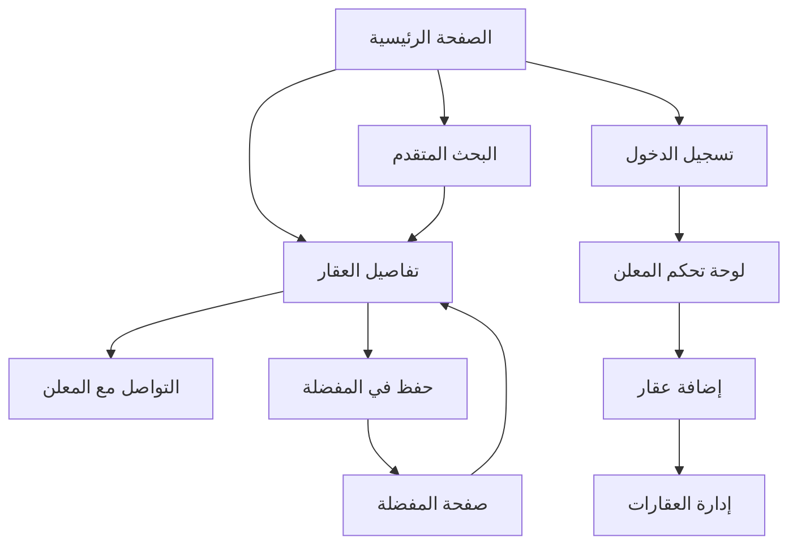

# متطلبات تحسين نظام إدارة العقارات

## 1. نظرة عامة على المنتج

نظام إدارة العقارات المتكامل يهدف إلى توفير منصة شاملة لإدارة وعرض العقارات مع ميزات متقدمة تنافس أفضل المواقع العقارية مثل sahibinden.com. النظام يحل مشكلة نقص التفاصيل في العقارات المعروضة ويوفر تجربة مستخدم محسنة للباحثين عن العقارات والمعلنين.

الهدف هو زيادة دقة البيانات العقارية وتحسين تجربة البحث لتصبح المنصة الرائدة في السوق العقاري المحلي.

## 2. الميزات الأساسية

### 2.1 أدوار المستخدمين

| الدور | طريقة التسجيل | الصلاحيات الأساسية |
|------|----------------|--------------------|
| مستخدم عادي | التسجيل بالبريد الإلكتروني | تصفح العقارات، حفظ المفضلة، التواصل مع المعلنين |
| معلن | ترقية الحساب بعد التحقق | إضافة وإدارة العقارات، عرض الإحصائيات، الرد على الاستفسارات |
| مدير النظام | دعوة إدارية | إدارة جميع العقارات والمستخدمين، الموافقة على الإعلانات، إدارة النظام |

### 2.2 وحدات الميزات

نظام إدارة العقارات المحسن يتكون من الصفحات الأساسية التالية:

1. **الصفحة الرئيسية**: عرض العقارات المميزة، شريط البحث المتقدم، فلاتر سريعة، إحصائيات السوق
2. **صفحة البحث المتقدم**: فلاتر شاملة، خريطة تفاعلية، نتائج مفصلة، حفظ البحث
3. **صفحة تفاصيل العقار**: معلومات شاملة، معرض صور، خريطة الموقع، معلومات الاتصال، عقارات مشابهة
4. **صفحة إضافة العقار**: نموذج متعدد الخطوات، رفع الصور، تحديد الموقع، اختيار الميزات والمرافق
5. **لوحة تحكم المعلن**: إدارة العقارات، الإحصائيات، الرسائل، إعدادات الحساب
6. **صفحة المفضلة**: العقارات المحفوظة، مقارنة العقارات، تنبيهات الأسعار

### 2.3 تفاصيل الصفحات

| اسم الصفحة | اسم الوحدة | وصف الميزة |
|------------|------------|------------|
| الصفحة الرئيسية | شريط البحث المتقدم | بحث بالموقع، النوع، السعر، المساحة، عدد الغرف، الطابق، وجود مصعد، الشرفة |
| الصفحة الرئيسية | عرض العقارات المميزة | عرض العقارات بالصور، السعر، الموقع، الميزات الأساسية، حالة التوفر |
| صفحة البحث المتقدم | فلاتر شاملة | فلترة حسب جميع الخصائص الجديدة: الطابق، المصعد، الاتجاه، الإطلالة، عمر المبنى |
| صفحة البحث المتقدم | خريطة تفاعلية | عرض النتائج على الخريطة، تحديد المنطقة، حساب المسافات للخدمات |
| صفحة تفاصيل العقار | معلومات شاملة | عرض جميع التفاصيل الجديدة: معلومات المبنى، الميزات، المرافق القريبة، التكاليف الإضافية |
| صفحة تفاصيل العقار | معرض صور محسن | عرض الصور بجودة عالية، تصنيف الصور، عرض ثلاثي الأبعاد إن وجد |
| صفحة إضافة العقار | خطوة معلومات المبنى | إدخال رقم الطابق، إجمالي الطوابق، عمر المبنى، نوع المبنى، وجود مصعد |
| صفحة إضافة العقار | خطوة التفاصيل الداخلية | نوع الأرضية، نوع النوافذ، عدد الشرفات، الاتجاه، نوع الإطلالة |
| صفحة إضافة العقار | خطوة المعلومات المالية | رسوم الصيانة، مبلغ التأمين، الضرائب السنوية، تكاليف المرافق |
| صفحة إضافة العقار | اختيار الميزات والمرافق | اختيار من قائمة محدثة تشمل المصعد، الأمان، المرافق القريبة |
| لوحة تحكم المعلن | إحصائيات متقدمة | عدد المشاهدات، الاستفسارات، معدل الاهتمام، مقارنة مع العقارات المشابهة |
| لوحة تحكم المعلن | إدارة العقارات | تعديل التفاصيل، تحديث الصور، تغيير الحالة، تجديد الإعلان |

## 3. العملية الأساسية

### تدفق المستخدم العادي:
1. زيارة الصفحة الرئيسية واستخدام البحث السريع أو المتقدم
2. تصفح النتائج مع إمكانية الفلترة حسب الميزات الجديدة
3. عرض تفاصيل العقار مع جميع المعلومات الشاملة
4. حفظ العقارات المهمة في المفضلة
5. التواصل مع المعلن عبر النظام

### تدفق المعلن:
1. تسجيل الدخول إلى لوحة التحكم
2. إضافة عقار جديد عبر النموذج المتعدد الخطوات
3. إدخال جميع التفاصيل الجديدة والميزات
4. رفع الصور وتحديد الموقع
5. نشر الإعلان ومتابعة الإحصائيات

## 4. تصميم واجهة المستخدم

### 4.1 نمط التصميم

- **الألوان الأساسية**: أزرق داكن (#1e40af) للعناصر الرئيسية، أخضر (#10b981) للأزرار الإيجابية
- **الألوان الثانوية**: رمادي فاتح (#f8fafc) للخلفيات، رمادي داكن (#374151) للنصوص
- **نمط الأزرار**: أزرار مستديرة الحواف مع ظلال خفيفة وتأثيرات hover
- **الخطوط**: Tajawal للعربية، Inter للإنجليزية، أحجام 14px-24px
- **نمط التخطيط**: تصميم بطاقات مع شبكة مرنة، شريط تنقل علوي ثابت
- **الأيقونات**: Font Awesome مع تفضيل الأيقونات الملونة للميزات المهمة

### 4.2 نظرة عامة على تصميم الصفحات

| اسم الصفحة | اسم الوحدة | عناصر واجهة المستخدم |
|------------|------------|----------------------|
| الصفحة الرئيسية | شريط البحث | تصميم بارز مع خلفية متدرجة، حقول بحث متعددة، زر بحث كبير باللون الأزرق |
| الصفحة الرئيسية | بطاقات العقارات | تصميم بطاقات أنيق مع صور كبيرة، معلومات مختصرة، أيقونات الميزات الملونة |
| صفحة البحث المتقدم | لوحة الفلاتر | شريط جانبي قابل للطي، مجموعات فلاتر منظمة، عدادات النتائج المباشرة |
| صفحة البحث المتقدم | خريطة تفاعلية | خريطة بملء الشاشة، علامات ملونة للعقارات، نوافذ معلومات منبثقة |
| صفحة تفاصيل العقار | معرض الصور | عرض شرائح كبير، صور مصغرة، أزرار تنقل، إمكانية التكبير |
| صفحة تفاصيل العقار | جدول المعلومات | تخطيط شبكي منظم، أيقونات للخصائص، ألوان مميزة للقيم المهمة |
| صفحة إضافة العقار | مؤشر التقدم | شريط تقدم علوي، أرقام الخطوات، ألوان تدل على الإنجاز |
| صفحة إضافة العقار | نماذج الإدخال | حقول واضحة مع تسميات، رسائل تحقق ملونة، مساعدات نصية |

### 4.3 الاستجابة للأجهزة

النظام مصمم ليكون متجاوب بالكامل مع تحسين خاص للأجهزة المحمولة. يتضمن تحسينات اللمس للتفاعل مع الخرائط والمعارض، وتخطيطات مكيفة للشاشات الصغيرة مع قوائم قابلة للطي والتمرير السلس.

## 5. المتطلبات التقنية الإضافية

### 5.1 قاعدة البيانات
- إضافة فهارس جديدة للبحث السريع
- تحسين استعلامات البحث المعقد
- دعم البحث النصي الكامل

### 5.2 الأداء
- تحسين تحميل الصور مع lazy loading
- ضغط البيانات للاستعلامات الكبيرة
- تخزين مؤقت للبحثات الشائعة

### 5.3 الأمان
- تحقق من صحة جميع البيانات الجديدة
- حماية من SQL injection في الفلاتر
- تشفير المعلومات الحساسة

### 5.4 التوافق
- دعم جميع المتصفحات الحديثة
- تحسين لمحركات البحث (SEO)
- إمكانية الوصول للمستخدمين ذوي الاحتياجات الخاصة