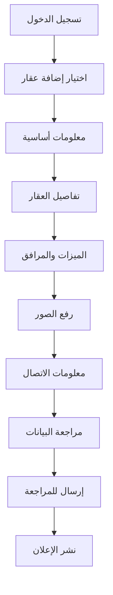

# تحليل مقارن: خطوات إنشاء إعلان العقار في sahibinden.com مقابل النظام الحالي

## 1. نظرة عامة على المشروع

هذا التحليل يهدف إلى مقارنة عملية إنشاء إعلان العقار في موقع sahibinden.com التركي الشهير مع النظام الحالي لإنشاء العقارات، وتحديد الحقول والميزات المفقودة لتحسين تجربة المستخدم وزيادة فعالية النظام.

## 2. الميزات الأساسية

### 2.1 خطوات إنشاء الإعلان في sahibinden.com

بناءً على البحث المتاح، تتضمن خطوات إنشاء إعلان العقار في sahibinden.com:

1. **تسجيل الدخول والتحقق من الهوية**
   - تسجيل دخول المستخدم
   - التحقق من رقم الهاتف المحمول
   - التحقق من هوية المالك أو الوكيل العقاري

2. **اختيار نوع الإعلان والعقار**
   - تحديد نوع الإعلان (للبيع/للإيجار)
   - اختيار نوع العقار (شقة، منزل، فيلا، إلخ)
   - تحديد الفئة الفرعية

3. **معلومات العقار الأساسية**
   - عنوان العقار والموقع
   - رقم الطابق ومعلومات المبنى
   - المساحة بالمتر المربع
   - عدد الغرف والحمامات
   - سنة البناء

4. **التفاصيل والمواصفات**
   - حالة العقار (جديد، مستعمل، قيد الإنشاء)
   - نوع التدفئة
   - وجود مصعد
   - وجود شرفة
   - موقف السيارات
   - الأمان والحراسة

5. **السعر والشروط المالية**
   - السعر الأساسي
   - نوع السعر (شهري، سنوي، إجمالي)
   - الودائع والرسوم الإضافية
   - شروط الدفع

6. **الصور والوسائط**
   - رفع صور متعددة للعقار
   - تحديد الصورة الرئيسية
   - إضافة جولة افتراضية (اختياري)

7. **معلومات الاتصال**
   - بيانات المعلن
   - رقم الهاتف
   - البريد الإلكتروني

### 2.2 الحقول الموجودة في النظام الحالي

النظام الحالي يتضمن الحقول التالية:

| الحقل | النوع | مطلوب | الوصف |
|-------|-------|--------|-------|
| العنوان | نص | نعم | عنوان العقار |
| العنوان التفصيلي | نص | نعم | الشارع والمنطقة |
| المدينة | اختيار | نعم | المدينة |
| المحافظة | اختيار | نعم | المحافظة |
| نوع الإعلان | اختيار | نعم | للبيع/للإيجار |
| نوع العقار | اختيار | نعم | شقة، منزل، فيلا، إلخ |
| نوع الوثيقة | اختيار | نعم | سند ملكية، عقد، إلخ |
| عدد الغرف | رقم | نعم | عدد غرف النوم |
| عدد الحمامات | رقم | نعم | عدد الحمامات |
| المساحة | رقم | نعم | المساحة بالمتر المربع |
| السعر | رقم | نعم | السعر |
| نوع السعر | اختيار | نعم | شهري، سنوي، إجمالي |
| سنة البناء | رقم | نعم | سنة بناء العقار |
| الوصف | نص طويل | نعم | وصف تفصيلي للعقار |
| موقف السيارات | اختيار | نعم | نوع موقف السيارات |
| مساحة الأرض | رقم | اختياري | مساحة قطعة الأرض |
| المرآب | نص | اختياري | تفاصيل المرآب |
| التدفئة | نص | اختياري | نوع التدفئة |
| رسوم الجمعية | نص | اختياري | رسوم إدارة المبنى |
| المبنى | نص | اختياري | معلومات المبنى |
| المسبح | نص | اختياري | وجود مسبح |
| تاريخ التوفر | تاريخ | اختياري | تاريخ توفر العقار |
| سياسة الحيوانات | نص | اختياري | قبول الحيوانات الأليفة |
| المرافق | نص | اختياري | المرافق المتاحة |
| اسم المعلن | نص | نعم | اسم الشخص المعلن |
| هاتف المعلن | نص | نعم | رقم هاتف المعلن |
| بريد المعلن | بريد إلكتروني | نعم | بريد إلكتروني للمعلن |
| الإحداثيات | رقم | اختياري | خط الطول والعرض |
| الصور | ملفات | اختياري | صور العقار |
| الميزات | متعدد الاختيار | اختياري | ميزات العقار |
| المرافق | متعدد الاختيار | اختياري | المرافق المتاحة |

### 2.3 تفاصيل الصفحات

| اسم الصفحة | اسم الوحدة | وصف الميزة |
|-------------|-------------|-------------|
| إضافة عقار | معلومات أساسية | إدخال العنوان، الموقع، نوع العقار والإعلان |
| إضافة عقار | تفاصيل العقار | المساحة، الغرف، الحمامات، السعر، سنة البناء |
| إضافة عقار | الميزات والمرافق | اختيار الميزات المتاحة مثل المصعد، الشرفة، المسبح |
| إضافة عقار | الصور والوسائط | رفع صور متعددة وتحديد الصورة الرئيسية |
| إضافة عقار | معلومات الاتصال | بيانات المعلن وطرق التواصل |

## 3. العملية الأساسية

### تدفق المستخدم العادي:
1. تسجيل الدخول أو إنشاء حساب جديد
2. اختيار "إضافة عقار" من القائمة الرئيسية
3. ملء معلومات العقار الأساسية (العنوان، النوع، السعر)
4. إضافة التفاصيل والمواصفات
5. اختيار الميزات والمرافق المتاحة
6. رفع الصور وتحديد الصورة الرئيسية
7. إدخال معلومات الاتصال
8. مراجعة البيانات وإرسال الإعلان للمراجعة
9. انتظار الموافقة ونشر الإعلان



## 4. تصميم واجهة المستخدم

### 4.1 نمط التصميم
- الألوان الأساسية: #067977 (أخضر داكن)، #f8f9fa (رمادي فاتح)
- الألوان الثانوية: أخضر فاتح، برتقالي، بنفسجي للأقسام المختلفة
- نمط الأزرار: مستطيلة مع زوايا مدورة وتأثيرات انتقالية
- الخط: Cairo وTajawal للنصوص العربية
- نمط التخطيط: بطاقات متدرجة مع خلفيات ملونة
- الأيقونات: Lucide React icons مع ألوان متناسقة

### 4.2 نظرة عامة على تصميم الصفحات

| اسم الصفحة | اسم الوحدة | عناصر واجهة المستخدم |
|-------------|-------------|----------------------|
| إضافة عقار | الخطوة 1 - المعلومات الأساسية | خلفية متدرجة أخضر، حقول إدخال مع أيقونات، خريطة تفاعلية |
| إضافة عقار | الخطوة 2 - تفاصيل العقار | قوائم منسدلة ملونة، حقول رقمية مع تحقق، اختيار الميزات |
| إضافة عقار | الخطوة 3 - الصور | منطقة سحب وإفلات، معاينة الصور، تحديد الصورة الرئيسية |
| إضافة عقار | الخطوة 4 - معلومات الاتصال | حقول إدخال مع تحقق، أزرار تنقل ملونة |

### 4.3 الاستجابة للأجهزة
النظام مصمم ليكون متجاوب مع جميع الأجهزة مع تحسين خاص للهواتف المحمولة والأجهزة اللوحية.

## 5. الحقول والميزات المفقودة

### 5.1 الحقول المفقودة المهمة من sahibinden.com:

1. **معلومات المبنى:**
   - رقم الطابق
   - إجمالي عدد الطوابق في المبنى
   - وجود مصعد (elevator) ✓ مطلوب
   - عمر المبنى
   - نوع المبنى (سكني، تجاري، مختلط)

2. **الميزات الداخلية:**
   - وجود شرفة (balcony) ✓ مطلوب
   - عدد الشرفات
   - نوع الأرضيات
   - نوع النوافذ
   - اتجاه العقار (شمال، جنوب، شرق، غرب)
   - إطلالة العقار (بحر، جبل، شارع، حديقة)

3. **المرافق والخدمات:**
   - الأمان (حارس، كاميرات مراقبة، بوابة إلكترونية)
   - الخدمات (إنترنت، كابل، غاز طبيعي)
   - المرافق المشتركة (صالة رياضية، حديقة، ملعب أطفال)
   - المرافق القريبة (مدارس، مستشفيات، مواصلات)

4. **معلومات مالية إضافية:**
   - الودائع المطلوبة
   - رسوم الصيانة الشهرية
   - الضرائب السنوية
   - تكاليف إضافية (كهرباء، ماء، غاز)

5. **معلومات قانونية:**
   - حالة الترخيص
   - قيود الاستخدام
   - إمكانية الحصول على قرض
   - حالة التأمين

### 5.2 ميزات تحسين تجربة المستخدم:

1. **التحقق والتوثيق:**
   - التحقق من رقم الهاتف
   - التحقق من هوية المالك
   - ربط مع الوثائق الرسمية

2. **الذكاء الاصطناعي:**
   - اقتراح السعر بناءً على السوق
   - تحسين الوصف تلقائياً
   - تصنيف الصور تلقائياً

3. **التسويق والترويج:**
   - خيارات الإعلان المدفوع
   - إحصائيات المشاهدة
   - تقارير الأداء

## 6. اقتراحات التحسين والإضافات

### 6.1 إضافات فورية (أولوية عالية):

1. **إضافة حقل المصعد:**
```typescript
elevator: z.enum(['yes', 'no']).optional()
```

2. **إضافة حقل الشرفة:**
```typescript
balcony: z.enum(['yes', 'no']).optional(),
balconyCount: z.number().min(0).max(10).optional()
```

3. **معلومات الطابق:**
```typescript
floorNumber: z.number().min(0).max(100).optional(),
totalFloors: z.number().min(1).max(100).optional()
```

4. **الاتجاه والإطلالة:**
```typescript
orientation: z.enum(['north', 'south', 'east', 'west', 'northeast', 'northwest', 'southeast', 'southwest']).optional(),
view: z.enum(['sea', 'mountain', 'street', 'garden', 'city']).optional()
```

### 6.2 تحسينات متوسطة الأولوية:

1. **نظام التقييم والمراجعات**
2. **خريطة تفاعلية محسنة مع معلومات المنطقة**
3. **حاسبة القرض العقاري**
4. **مقارنة الأسعار مع العقارات المشابهة**
5. **نظام الإشعارات للمهتمين**

### 6.3 ميزات متقدمة (أولوية منخفضة):

1. **الجولة الافتراضية 360 درجة**
2. **الذكاء الاصطناعي لتقدير السعر**
3. **التكامل مع منصات التواصل الاجتماعي**
4. **نظام إدارة العملاء المحتملين**
5. **تطبيق الهاتف المحمول**

## 7. خطة التنفيذ

### المرحلة الأولى (1-2 أسابيع):
- إضافة الحقول المفقودة الأساسية (مصعد، شرفة، طابق)
- تحديث نموذج قاعدة البيانات
- تعديل واجهة إضافة العقار

### المرحلة الثانية (2-3 أسابيع):
- إضافة ميزات الاتجاه والإطلالة
- تحسين نظام رفع الصور
- إضافة المزيد من خيارات الميزات والمرافق

### المرحلة الثالثة (3-4 أسابيع):
- تطوير نظام التحقق والتوثيق
- إضافة الإحصائيات والتقارير
- تحسين تجربة المستخدم العامة

### المرحلة الرابعة (4-6 أسابيع):
- تطوير الميزات المتقدمة
- اختبار شامل للنظام
- تحسين الأداء والأمان

## 8. الخلاصة

النظام الحالي يحتوي على أساس جيد لإنشاء إعلانات العقارات، لكنه يحتاج إلى إضافات مهمة ليصبح مماثلاً لموقع sahibinden.com من حيث الشمولية والتفصيل. أهم الإضافات المطلوبة هي:

1. **حقول المبنى:** مصعد، شرفة، رقم الطابق
2. **تفاصيل إضافية:** اتجاه العقار، الإطلالة، نوع الأرضيات
3. **نظام تحقق:** التحقق من الهوية والوثائق
4. **ميزات تسويقية:** إحصائيات، ترويج مدفوع

تنفيذ هذه التحسينات سيجعل النظام أكثر تنافسية وفعالية في السوق العقاري.