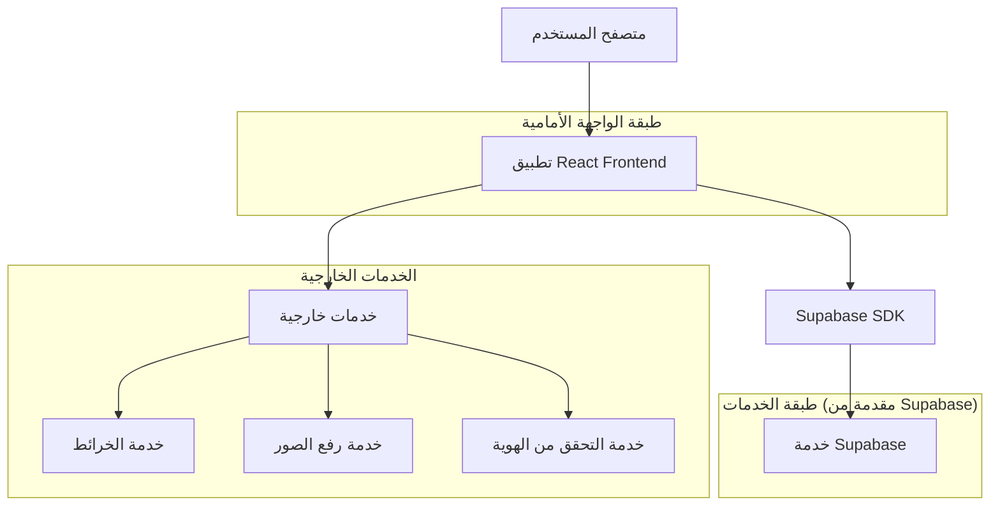
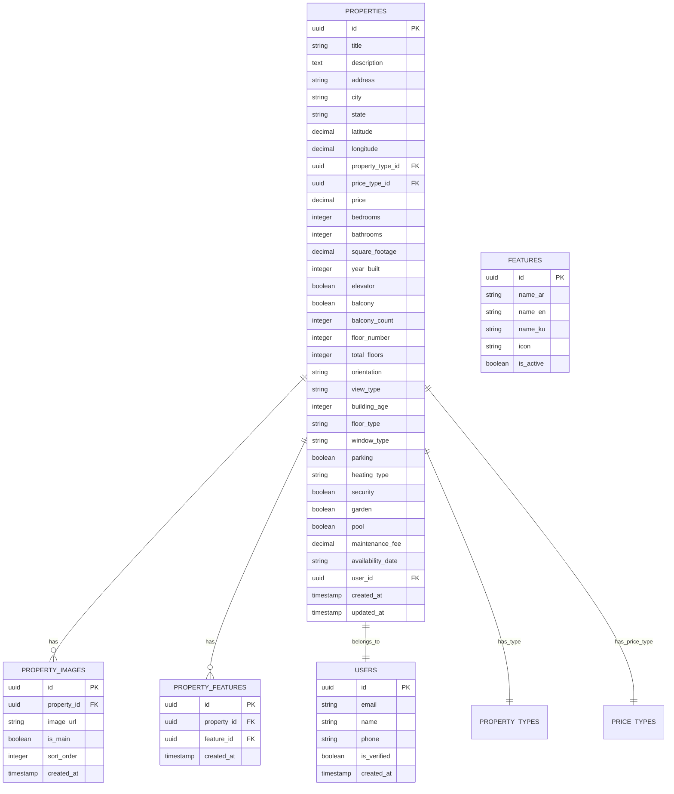

# البنية التقنية للتحسينات المقترحة على نظام إدارة العقارات

## 1. تصميم البنية



## 2. وصف التقنيات

- Frontend: React@18 + TypeScript + Tailwind CSS@3 + Vite
- Backend: Supabase (PostgreSQL + Authentication + Storage)
- State Management: React Hook Form + Zod validation
- UI Components: Lucide React Icons + Custom Components
- Maps: Leaflet أو Google Maps API
- Image Upload: Supabase Storage
- Authentication: Supabase Auth

## 3. تعريف المسارات

| المسار | الغرض |
|--------|-------|
| /properties/add | صفحة إضافة عقار جديد مع الحقول المحسنة |
| /properties/edit/:id | صفحة تعديل عقار موجود |
| /properties/:id | صفحة تفاصيل العقار مع الميزات الجديدة |
| /properties/search | صفحة البحث المتقدم مع الفلاتر الجديدة |
| /dashboard | لوحة تحكم المستخدم مع الإحصائيات |
| /profile/verification | صفحة التحقق من الهوية |

## 4. تعريف واجهات برمجة التطبيقات

### 4.1 واجهات برمجة التطبيقات الأساسية

#### إضافة/تحديث العقار
```
POST/PUT /api/properties
```

الطلب:
| اسم المعامل | نوع المعامل | مطلوب | الوصف |
|-------------|-------------|--------|-------|
| title | string | true | عنوان العقار |
| address | string | true | العنوان التفصيلي |
| propertyType | string | true | نوع العقار |
| listingType | string | true | نوع الإعلان |
| price | number | true | السعر |
| bedrooms | number | true | عدد الغرف |
| bathrooms | number | true | عدد الحمامات |
| squareFootage | number | true | المساحة |
| elevator | boolean | false | وجود مصعد |
| balcony | boolean | false | وجود شرفة |
| balconyCount | number | false | عدد الشرفات |
| floorNumber | number | false | رقم الطابق |
| totalFloors | number | false | إجمالي الطوابق |
| orientation | string | false | اتجاه العقار |
| view | string | false | الإطلالة |
| buildingAge | number | false | عمر المبنى |
| floorType | string | false | نوع الأرضية |
| windowType | string | false | نوع النوافذ |

الاستجابة:
| اسم المعامل | نوع المعامل | الوصف |
|-------------|-------------|-------|
| success | boolean | حالة العملية |
| propertyId | string | معرف العقار |
| message | string | رسالة النتيجة |

مثال:
```json
{
  "title": "شقة فاخرة في وسط المدينة",
  "address": "شارع الملك فيصل، الدوار الأول",
  "propertyType": "apartment",
  "listingType": "sale",
  "price": 150000,
  "bedrooms": 3,
  "bathrooms": 2,
  "squareFootage": 120,
  "elevator": true,
  "balcony": true,
  "balconyCount": 2,
  "floorNumber": 5,
  "totalFloors": 10,
  "orientation": "south",
  "view": "city"
}
```

#### البحث المتقدم
```
GET /api/properties/search
```

الطلب:
| اسم المعامل | نوع المعامل | مطلوب | الوصف |
|-------------|-------------|--------|-------|
| minPrice | number | false | الحد الأدنى للسعر |
| maxPrice | number | false | الحد الأقصى للسعر |
| propertyType | string | false | نوع العقار |
| bedrooms | number | false | عدد الغرف |
| elevator | boolean | false | وجود مصعد |
| balcony | boolean | false | وجود شرفة |
| orientation | string | false | اتجاه العقار |
| view | string | false | نوع الإطلالة |
| minFloor | number | false | الحد الأدنى للطابق |
| maxFloor | number | false | الحد الأقصى للطابق |

## 5. نموذج البيانات

### 5.1 تعريف نموذج البيانات



### 5.2 لغة تعريف البيانات

#### جدول العقارات المحسن
```sql
-- إنشاء الجدول
CREATE TABLE properties (
    id UUID PRIMARY KEY DEFAULT gen_random_uuid(),
    title VARCHAR(255) NOT NULL,
    description TEXT,
    address TEXT NOT NULL,
    city VARCHAR(100) NOT NULL,
    state VARCHAR(100) NOT NULL,
    latitude DECIMAL(10, 8),
    longitude DECIMAL(11, 8),
    property_type_id UUID REFERENCES property_types(id),
    price_type_id UUID REFERENCES price_types(id),
    price DECIMAL(12, 2) NOT NULL,
    bedrooms INTEGER NOT NULL,
    bathrooms INTEGER NOT NULL,
    square_footage DECIMAL(8, 2) NOT NULL,
    year_built INTEGER,
    
    -- الحقول الجديدة المضافة
    elevator BOOLEAN DEFAULT false,
    balcony BOOLEAN DEFAULT false,
    balcony_count INTEGER DEFAULT 0,
    floor_number INTEGER,
    total_floors INTEGER,
    orientation VARCHAR(20) CHECK (orientation IN ('north', 'south', 'east', 'west', 'northeast', 'northwest', 'southeast', 'southwest')),
    view_type VARCHAR(20) CHECK (view_type IN ('sea', 'mountain', 'street', 'garden', 'city')),
    building_age INTEGER,
    floor_type VARCHAR(50),
    window_type VARCHAR(50),
    
    -- الحقول الموجودة مسبقاً
    parking BOOLEAN DEFAULT false,
    heating_type VARCHAR(100),
    security BOOLEAN DEFAULT false,
    garden BOOLEAN DEFAULT false,
    pool BOOLEAN DEFAULT false,
    maintenance_fee DECIMAL(8, 2),
    availability_date DATE,
    
    user_id UUID REFERENCES auth.users(id),
    created_at TIMESTAMP WITH TIME ZONE DEFAULT NOW(),
    updated_at TIMESTAMP WITH TIME ZONE DEFAULT NOW()
);

-- إنشاء الفهارس
CREATE INDEX idx_properties_user_id ON properties(user_id);
CREATE INDEX idx_properties_property_type ON properties(property_type_id);
CREATE INDEX idx_properties_price_range ON properties(price);
CREATE INDEX idx_properties_location ON properties(city, state);
CREATE INDEX idx_properties_bedrooms ON properties(bedrooms);
CREATE INDEX idx_properties_elevator ON properties(elevator);
CREATE INDEX idx_properties_balcony ON properties(balcony);
CREATE INDEX idx_properties_floor ON properties(floor_number);
CREATE INDEX idx_properties_orientation ON properties(orientation);
CREATE INDEX idx_properties_view ON properties(view_type);
CREATE INDEX idx_properties_created_at ON properties(created_at DESC);

-- جدول الميزات الجديدة
CREATE TABLE features (
    id UUID PRIMARY KEY DEFAULT gen_random_uuid(),
    name_ar VARCHAR(100) NOT NULL,
    name_en VARCHAR(100) NOT NULL,
    name_ku VARCHAR(100) NOT NULL,
    icon VARCHAR(50),
    category VARCHAR(50) NOT NULL,
    is_active BOOLEAN DEFAULT true,
    created_at TIMESTAMP WITH TIME ZONE DEFAULT NOW()
);

-- جدول ربط العقارات بالميزات
CREATE TABLE property_features (
    id UUID PRIMARY KEY DEFAULT gen_random_uuid(),
    property_id UUID REFERENCES properties(id) ON DELETE CASCADE,
    feature_id UUID REFERENCES features(id) ON DELETE CASCADE,
    created_at TIMESTAMP WITH TIME ZONE DEFAULT NOW(),
    UNIQUE(property_id, feature_id)
);

-- إدراج البيانات الأولية للميزات
INSERT INTO features (name_ar, name_en, name_ku, icon, category) VALUES
('مصعد', 'Elevator', 'Asansor', 'building', 'building'),
('شرفة', 'Balcony', 'Balkon', 'home', 'interior'),
('حديقة', 'Garden', 'Bahçe', 'trees', 'exterior'),
('مسبح', 'Swimming Pool', 'Yüzme Havuzu', 'waves', 'amenities'),
('موقف سيارات', 'Parking', 'Otopark', 'car', 'parking'),
('أمان 24/7', '24/7 Security', '24/7 Güvenlik', 'shield', 'security'),
('صالة رياضية', 'Gym', 'Spor Salonu', 'dumbbell', 'amenities'),
('مكيف هواء', 'Air Conditioning', 'Klima', 'wind', 'climate'),
('تدفئة مركزية', 'Central Heating', 'Merkezi Isıtma', 'thermometer', 'climate'),
('إنترنت عالي السرعة', 'High Speed Internet', 'Yüksek Hızlı İnternet', 'wifi', 'utilities');

-- صلاحيات الوصول
GRANT SELECT ON properties TO anon;
GRANT ALL PRIVILEGES ON properties TO authenticated;
GRANT SELECT ON features TO anon;
GRANT ALL PRIVILEGES ON features TO authenticated;
GRANT SELECT ON property_features TO anon;
GRANT ALL PRIVILEGES ON property_features TO authenticated;

-- تحديث الجدول الموجود (إذا كان موجوداً)
ALTER TABLE properties ADD COLUMN IF NOT EXISTS elevator BOOLEAN DEFAULT false;
ALTER TABLE properties ADD COLUMN IF NOT EXISTS balcony BOOLEAN DEFAULT false;
ALTER TABLE properties ADD COLUMN IF NOT EXISTS balcony_count INTEGER DEFAULT 0;
ALTER TABLE properties ADD COLUMN IF NOT EXISTS floor_number INTEGER;
ALTER TABLE properties ADD COLUMN IF NOT EXISTS total_floors INTEGER;
ALTER TABLE properties ADD COLUMN IF NOT EXISTS orientation VARCHAR(20);
ALTER TABLE properties ADD COLUMN IF NOT EXISTS view_type VARCHAR(20);
ALTER TABLE properties ADD COLUMN IF NOT EXISTS building_age INTEGER;
ALTER TABLE properties ADD COLUMN IF NOT EXISTS floor_type VARCHAR(50);
ALTER TABLE properties ADD COLUMN IF NOT EXISTS window_type VARCHAR(50);

-- إضافة قيود التحقق للحقول الجديدة
ALTER TABLE properties ADD CONSTRAINT check_orientation 
    CHECK (orientation IS NULL OR orientation IN ('north', 'south', 'east', 'west', 'northeast', 'northwest', 'southeast', 'southwest'));
    
ALTER TABLE properties ADD CONSTRAINT check_view_type 
    CHECK (view_type IS NULL OR view_type IN ('sea', 'mountain', 'street', 'garden', 'city'));
    
ALTER TABLE properties ADD CONSTRAINT check_floor_number 
    CHECK (floor_number IS NULL OR floor_number >= 0);
    
ALTER TABLE properties ADD CONSTRAINT check_total_floors 
    CHECK (total_floors IS NULL OR total_floors >= 1);
    
ALTER TABLE properties ADD CONSTRAINT check_balcony_count 
    CHECK (balcony_count >= 0 AND balcony_count <= 10);
```

#### تحديث أنواع TypeScript
```typescript
// تحديث واجهة Property
export interface Property {
  id: string;
  title: string;
  description?: string;
  address: string;
  city: string;
  state: string;
  latitude?: number;
  longitude?: number;
  propertyTypeId: string;
  priceTypeId: string;
  price: number;
  bedrooms: number;
  bathrooms: number;
  squareFootage: number;
  yearBuilt?: number;
  
  // الحقول الجديدة
  elevator?: boolean;
  balcony?: boolean;
  balconyCount?: number;
  floorNumber?: number;
  totalFloors?: number;
  orientation?: 'north' | 'south' | 'east' | 'west' | 'northeast' | 'northwest' | 'southeast' | 'southwest';
  viewType?: 'sea' | 'mountain' | 'street' | 'garden' | 'city';
  buildingAge?: number;
  floorType?: string;
  windowType?: string;
  
  // الحقول الموجودة
  parking?: boolean;
  heatingType?: string;
  security?: boolean;
  garden?: boolean;
  pool?: boolean;
  maintenanceFee?: number;
  availabilityDate?: string;
  
  userId: string;
  createdAt: string;
  updatedAt: string;
  
  // العلاقات
  propertyType?: PropertyType;
  priceType?: PriceType;
  images?: PropertyImage[];
  features?: Feature[];
}

// واجهة الميزات
export interface Feature {
  id: string;
  nameAr: string;
  nameEn: string;
  nameKu: string;
  icon?: string;
  category: string;
  isActive: boolean;
  createdAt: string;
}

// واجهة ربط العقار بالميزات
export interface PropertyFeature {
  id: string;
  propertyId: string;
  featureId: string;
  createdAt: string;
  feature?: Feature;
}
```

## 6. خطة التطوير التقني

### المرحلة الأولى: تحديث قاعدة البيانات
1. تنفيذ سكريبت SQL لإضافة الحقول الجديدة
2. إنشاء جداول الميزات والربط
3. إدراج البيانات الأولية للميزات
4. اختبار الاستعلامات الجديدة

### المرحلة الثانية: تحديث الواجهات
1. تحديث أنواع TypeScript
2. تعديل نموذج Zod للتحقق من البيانات
3. إضافة الحقول الجديدة لنموذج إضافة العقار
4. تحديث واجهة عرض تفاصيل العقار

### المرحلة الثالثة: تحسين البحث
1. إضافة فلاتر البحث الجديدة
2. تحسين استعلامات قاعدة البيانات
3. إضافة الفهارس المطلوبة
4. اختبار الأداء

### المرحلة الرابعة: الاختبار والنشر
1. اختبار شامل للميزات الجديدة
2. اختبار الأداء والأمان
3. مراجعة الكود والتوثيق
4. النشر التدريجي للإنتاج

## 7. اعتبارات الأمان والأداء

### الأمان:
- التحقق من صحة البيانات باستخدام Zod
- تشفير البيانات الحساسة
- التحكم في الوصول باستخدام Supabase RLS
- تسجيل العمليات المهمة

### الأداء:
- استخدام الفهارس المناسبة
- تحسين الاستعلامات
- تخزين مؤقت للبيانات المتكررة
- ضغط الصور وتحسينها

### قابلية التوسع:
- تصميم مرن للإضافات المستقبلية
- فصل المنطق عن العرض
- استخدام مكونات قابلة لإعادة الاستخدام
- توثيق شامل للكود